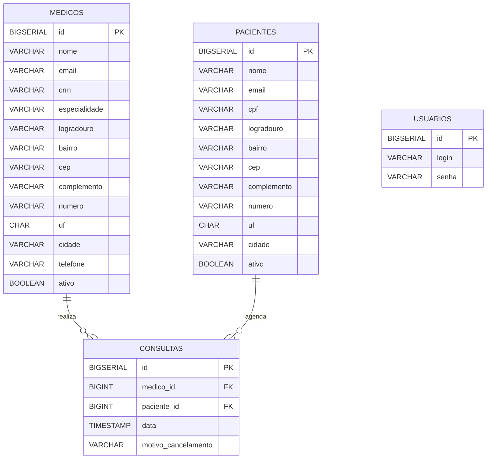

# 📚 API-Rest-Aplicacao-Med.Voll

Uma API REST desenvolvida com Spring Boot que simula uma aplicação médica. Inclui funcionalidades de cadastro, atualização, listagem e exclusão de médicos e pacientes, além de agendamento e cancelamento de consultas.

---

## 🛠️ Tecnologias Utilizadas

- Java 17  
- Spring Boot 3.4.3  
- Maven  
- Spring Data JPA  
- Hibernate Validator  
- PostgreSQL  
- Lombok  
- Flyway (para versionamento do banco)  

---

## 📌 Estrutura do Projeto

```bash
├── src
│   ├── main
│   │   ├── java
│   │   │   └── med.voll.api
│   │   │       ├── consulta # Endpoints REST
│   │   │       │   ├── agendamento 
│   │   │       │   │   ├── AgendarConsultas.java
│   │   │       │   │   ├── DadosAgendamentoConsulta.java
│   │   │       │   │   └── DadosDetalhamentoConsulta.java
│   │   │       │   ├── cancelamento 
│   │   │       │   │   ├── DadosCancelamentoConsulta.java
│   │   │       │   │   ├── DadosDetalhamentoCancelamento.java
│   │   │       │   │   └── MotivoCancelamento.java
│   │   │       │   ├── validacoes 
│   │   │       │   │   ├── agendamento
│   │   │       │   │   │   ├── ValidacaoException.java
│   │   │       │   │   │   ├── ValidacoesHorariosFuncionamentoClinica.java
│   │   │       │   │   │   ├── ValidadorDeAgendamentoDeConsulta.java
│   │   │       │   │   │   ├── validadorDeMedicosComOutraConsultaNesseHorario.java
│   │   │       │   │   │   ├── ValidadorHoraAntecipada.java
│   │   │       │   │   │   ├── ValidadorPacienteAtivo.java
│   │   │       │   │   │   ├── ValidadorPacienteSemOutraConsultaNoDia.java
│   │   │       │   │   │   └── ValidarMedicoAtivo.java
│   │   │       │   │   ├── cancelamento
│   │   │       │   │   │   ├── ValidadorCancelamentoDeConsulta.java
│   │   │       │   │   │   └── ValidadorHorarioAntecedencia.java
│   │   │       │   └── Consulta.java
│   │   │       ├── controller       # Endpoints REST
│   │   │       │   ├── AutenticacaoController.java
│   │   │       │   ├── CancelamentoController.java
│   │   │       │   ├── ConsultaController.java
│   │   │       │   ├── DoctorController.java
│   │   │       │   └── PacienteController.java
│   │   │       ├── domain           # Entidades, DTOs, regras de negócio
│   │   │       │   ├── endereco
│   │   │       │   │   ├── DadosEndereco.java
│   │   │       │   │   └── Endereco.java
│   │   │       │   ├── medico
│   │   │       │   │   ├── DadosAtualizacaoMedico.java
│   │   │       │   │   ├── DadosCadastroMedico.java
│   │   │       │   │   ├── DadosDetalhesMedicos.java
│   │   │       │   │   ├── DadosListaMedico.java
│   │   │       │   │   ├── Especialidade.java
│   │   │       │   │   └── Medico.java
│   │   │       │   ├── paciente
│   │   │       │   │   ├── DadosAtualizacaoPaciente.java
│   │   │       │   │   ├── DadosCadastroPaciente.java
│   │   │       │   │   ├── DadosListagemPaciente.java
│   │   │       │   │   └── Paciente.java
│   │   │       │   └── usuario
│   │   │       │   │   ├── AutenticacaoService.java
│   │   │       │   │   ├── DadosAutentucacao.java
│   │   │       │   │   └── Usuario.java
│   │   │       ├── infra       # Tratamento de erros, securança e configuração springDoc
│   │   │       │   ├── exception
│   │   │       │   │   ├── DadosErrosValidacao.java
│   │   │       │   │   └── TratadorDeErros.java
│   │   │       │   ├── security
│   │   │       │   │   ├── DadosTokenJWT.java
│   │   │       │   │   ├── SecurityConfigurations.java
│   │   │       │   │   ├── SecurityFilter.java
│   │   │       │   │   └── TokenService.java
│   │   │       │   └── springDoc
│   │   │       │   │   ├── CustomOpenApiConfig.java
│   │   │       │   │   └── SpringDocConfiguretion.java
│   │   │       ├── repository       # Interfaces JPA
│   │   │       │   ├── ConsultaRepository.java
│   │   │       │   ├── MedicoRepository.java
│   │   │       │   ├── PacienteRepository.java
│   │   │       │   └── UsuarioRepository.java
│   │   │       └── ApiApplication.java          
│   │   └── resources
│   │       ├── application.properties
│   │       └── db/migration         # Scripts Flyway
│   │           ├── V1__create-table-medicos.sql
│   │           ├── V2__alter-table-medicos-add-column-telefone.sql
│   │           ├── V3__alter-table-medicos-add-column-ativo.sql
│   │           ├── V4__create-table-pacientes.sql.sql
│   │           ├── V5__alter-table-pacientes-add-column-ativo.sql
│   │           ├── V6__alter-table-pacientes-add-column-telefone.sql
│   │           ├── V7__create-table-usuarios.sql
│   │           ├── V8__create-table-consulta.sql
│   │           └── V9__alter-table-consulta-add-column-motivo_cancelamento.sql
│   └── test
│       └── java
```

---

## 🧠 Modelo de Dados



---

## 🗃️ Modelo de Banco de Dados
Em produção eu usei o Banco: **PostgreSQL**  
Tabelas principais: `medicos`, `pacientes`, `usuarios`, `consultas` 

```sql
CREATE TABLE medicos (    
    id BIGSERIAL PRIMARY KEY,    
    nome VARCHAR(100) NOT NULL,    
    email VARCHAR(100) NOT NULL UNIQUE,    
    crm VARCHAR(6) NOT NULL UNIQUE,    
    especialidade VARCHAR(100) NOT NULL,    
    logradouro VARCHAR(100) NOT NULL,    
    bairro VARCHAR(100) NOT NULL,    
    cep VARCHAR(9) NOT NULL,    
    complemento VARCHAR(100),    
    numero VARCHAR(20),    
    uf CHAR(2) NOT NULL,    
    cidade VARCHAR(100) NOT NULL,
    telefone varchar(20) not null,
    ativo BOOLEAN
    );

CREATE TABLE pacientes (
    id BIGSERIAL PRIMARY KEY,
    nome VARCHAR(100) NOT NULL,
    email VARCHAR(100) NOT NULL UNIQUE,
    cpf VARCHAR(11) NOT NULL UNIQUE,
    logradouro VARCHAR(100) NOT NULL,
    bairro VARCHAR(100) NOT NULL,
    cep VARCHAR(9) NOT NULL,
    complemento VARCHAR(100),
    numero VARCHAR(20),
    uf CHAR(2) NOT NULL,
    cidade VARCHAR(100) NOT NULL,
    ativo BOOLEAN
);


CREATE TABLE usuarios (
    id BIGSERIAL PRIMARY KEY,
    login VARCHAR(100) NOT NULL,
    senha VARCHAR(255) NOT NULL
);


CREATE TABLE consultas (
    id BIGSERIAL PRIMARY KEY,
    medico_id BIGINT NOT NULL,
    paciente_id BIGINT NOT NULL,
    data TIMESTAMP NOT NULL,
    motivo_cancelamento VARCHAR(100),

    CONSTRAINT fk_consultas_medicos_id FOREIGN KEY (medico_id) REFERENCES medicos(id),
    CONSTRAINT fk_consultas_pacientes_id FOREIGN KEY (paciente_id) REFERENCES pacientes(id)
);

```

Em desenvolvimento eu usei o Banco: **MySQL**  
Tabelas principais: `medicos`, `pacientes`, `usuarios`, `consultas` 

```sql
create table medicos(

    id bigint not null auto_increment,
    nome varchar(100) not null,
    email varchar(100) not null unique,
    crm varchar(6) not null unique,
    especialidade varchar(100) not null,
    logradouro varchar(100) not null,
    bairro varchar(100) not null,
    cep varchar(9) not null,
    complemento varchar(100),
    numero varchar(20),
    uf char(2) not null,
    cidade varchar(100) not null,
    telefone varchar(20) not null,
    ativo tinyint not null,

    primary key(id)

);

CREATE TABLE pacientes (
    id SERIAL PRIMARY KEY,
    nome VARCHAR(100),
    email VARCHAR(100),
    cpf VARCHAR(11),
    endereco TEXT,
    telefone varchar(20) not null,
    ativo tinyint not null
);

CREATE TABLE usuarios (   
    id BIGSERIAL PRIMARY KEY,    
    login VARCHAR(100) NOT NULL,    
    senha VARCHAR(255) NOT NULL
    );

CREATE TABLE consultas (
    id SERIAL PRIMARY KEY,
    medico_id BIGINT REFERENCES medicos(id),
    paciente_id BIGINT REFERENCES pacientes(id),
    data TIMESTAMP,
    motivo_cancelamento VARCHAR(100)
);

```

---
## 🔐 Segurança das Senhas

Para garantir a segurança das senhas dos usuários no banco de dados, este projeto utiliza o algoritmo **BCrypt** para hash das senhas. 

- As senhas nunca são armazenadas em texto puro (plaintext).
- O BCrypt adiciona um salt automaticamente e aplica múltiplas iterações para dificultar ataques de força bruta.
- A aplicação está configurada para **gerar e validar senhas usando BCrypt**, garantindo um nível elevado de proteção.

Essa abordagem segue as boas práticas recomendadas para gerenciamento seguro de credenciais em aplicações web.

---

## 📋 Funcionalidades da API

### ✅ Endpoints principais

| Recurso   | Método | Endpoint          | Descrição                           |
|-----------|--------|-------------------|-------------------------------------|
| Usuário   | POST   | `/login`          | Autenticação e geração de token JWT |
| Médicos   | POST   | `/medicos`        | Cadastro de novo médico             |
| Médicos   | GET    | `/medicos`        | Listagem paginada de médicos        |
| Médicos   | PUT    | `/medicos`        | Atualizar dados de um médico        |
| Médicos   | DELETE | `/medicos/{id}`   | Excluir (inativar) médico           |
| Pacientes | POST   | `/pacientes`      | Cadastro de paciente                |
| Pacientes | GET    | `/pacientes`      | Listagem de pacientes               |
| Consultas | POST   | `/consultas`      | Agendar uma nova consulta           |
| Consultas | DELETE | `/consultas`      | Cancelar uma consulta agendada      |

## ✅ Validações de Agendamento de Consulta

Durante o processo de agendamento de uma consulta médica, diversas **regras de negócio** precisam ser respeitadas para garantir a integridade dos dados e a consistência do sistema. Na aplicação, essas validações foram implementadas seguindo o princípio da **responsabilidade única**, com cada classe validando um aspecto específico da solicitação de agendamento.

Todas as validações implementam a interface `ValidadorDeAgendamentoDeConsulta`, garantindo modularidade e extensibilidade no fluxo de agendamento.

---

### 🔍 Lista de Validações Implementadas

#### `ValidarMedicoAtivo`
Valida se o médico informado está ativo no sistema.  
Caso o ID do médico seja fornecido e o mesmo esteja inativo (ou excluído logicamente), o agendamento é **bloqueado**.

> **Exceção:** `Consulta nao pode ser agendada com o medico excluido!`

---

#### `ValidadorPacienteSemOutraConsultaNoDia`
Garante que um mesmo paciente não tenha **mais de uma consulta agendada no mesmo dia** (entre 7h e 18h), considerando o motivo da consulta.

> **Exceção:** `Paciente já possui consulta agendada para esse dia!`

---

#### `ValidadorPacienteAtivo`
Verifica se o paciente está **ativo** no sistema. Pacientes inativos (ou excluídos logicamente) não podem agendar consultas.

> **Exceção:** `Nao pode agendar consultas para pacientes excluidos!`

---

#### `ValidadorHoraAntecipada`
Garante que a consulta seja agendada com **no mínimo 30 minutos de antecedência** em relação ao horário atual.

> **Exceção:** `Consulta deve ser agendada com antecendencia de no minimo 30 minutos!`

---

#### `ValidadorDeMedicosComOutraConsultaNesseHorario`
Evita o **conflito de horários** ao verificar se o médico já possui uma consulta agendada no mesmo horário.

> **Exceção:** `Medico ja possui consulta agendada nesse horario!`

---

#### `ValidacoesHorariosFuncionamentoClinica`
Valida se a consulta está sendo agendada **dentro do horário de funcionamento da clínica**, que é de segunda a sábado, das 7h às 18h.  
Consultas aos domingos, antes das 7h ou após as 18h são rejeitadas.

> **Exceção:** `Consulta fora do horario de funcionamento da clinica!`

---

### 🧩 Arquitetura

Todas as classes de validação implementam a interface:

```java
public interface ValidadorDeAgendamentoDeConsulta {
    void validar(DadosAgendamentoConsulta dados);
}
```

## ❌ Validações de Cancelamento de Consulta

O cancelamento de uma consulta médica também está sujeito a **regras de negócio** que visam garantir a organização da agenda e o respeito ao tempo dos profissionais da saúde. As validações foram implementadas de forma modular, seguindo a mesma arquitetura usada no agendamento.

Todas as validações de cancelamento implementam a interface `ValidadorCancelamentoDeConsulta`, garantindo coesão e facilidade na evolução da lógica de negócio.

---

### 🔍 Lista de Validações Implementadas

#### `ValidadorHorarioAntecedencia`
Garante que uma consulta só possa ser cancelada com **no mínimo 24 horas de antecedência** em relação ao horário da consulta.

> **Exceção:** `Consulta somente pode ser cancelada com antecedência mínima de 24h!`

---

### 🧩 Arquitetura

As classes de validação de cancelamento implementam a interface:

```java
public interface ValidadorCancelamentoDeConsulta {
    void validar(DadosCancelamentoConsulta dados);
}
```

---

## 🖥️ Como executar o projeto localmente

### ✅ Pré-requisitos para usar **PostgreSQL**

- Java 17  
- PostgreSQL  
- Maven  

Caso deseje utilizar PostgreSQL, será necessário alterar o arquivo `pom.xml`, **removendo as dependências relacionadas ao MySQL**:

```xml
<dependency>
    <groupId>org.flywaydb</groupId>
    <artifactId>flyway-mysql</artifactId>
</dependency>

<dependency>
    <groupId>mysql</groupId>
    <artifactId>mysql-connector-java</artifactId>
    <version>8.0.33</version> 
    <scope>runtime</scope>
</dependency>
```

Além disso, você pode configurar a dependência correta do flyway-core de acordo com a versão do PostgreSQL utilizada.
Se souber qual versão do Flyway é compatível com seu banco, substitua conforme necessário se não souber a versão não irá funcionar o Flyway e terá que remover a `dependency`:

```xml
<dependency>
    <groupId>org.flywaydb</groupId>
    <artifactId>flyway-core</artifactId>
    <version>VERSÃO_COMPATÍVEL</version> <!-- Substitua pela versão adequada -->
</dependency>
```


### Pré-requisitos para usar **MySQL**

- Java 17  
- MySQL  
- Maven  

Caso deseje utilizar MySQL, será necessário remover a dependência do PostgreSQL do pom.xml

```xml
<dependency>
    <groupId>org.postgresql</groupId>
    <artifactId>postgresql</artifactId>
    <scope>runtime</scope>
</dependency>
```


### Passos

1. Clone o repositório:
    ```bash
    git clone https://github.com/Gabriel1000000/API-Rest-Aplicacao-Med.Voll.git
    ```

2. Configure o banco de dados no `application.properties`:

    ```properties
    spring.datasource.url=jdbc:postgresql://localhost:5432/vollmed
    spring.datasource.username=seu_usuario
    spring.datasource.password=sua_senha
    ```
    ---

    ```mysql
    spring.datasource.driver-class-name=com.mysql.cj.jdbc.Driver
    spring.datasource.url=jdbc:mysql://localhost:3306/vollMed_api
    spring.datasource.username=seu_usuario
    spring.datasource.password=sua_senha
    spring.jpa.database-platform=org.hibernate.dialect.MySQL8Dialect
    ```

3. As migrações Flyway são aplicadas automaticamente ao iniciar o projeto.

4. Execute o projeto:
    ```bash
    ./mvnw spring-boot:run
    ```

---

## 🧪 Testes

O projeto possui testes unitários e de repositório com **JUnit**.

```bash
./mvnw test
```

---

## 📱 Documentação da API (Swagger/OpenAPI)

Acesse a documentação da API gerada com Springdoc OpenAPI em:

```
http://localhost:8080/swagger-ui.html
```

---

## 📌 Observações Finais

Este projeto segue boas práticas de desenvolvimento:

- Utilização de **DTOs** para entrada e saída de dados  
- Camada de **validação** separada  
- Uso de **registros** do Java 17  
- Padrão de **código limpo** e **orientação a domínio**
- **Versionamento** de banco com Flyway  
